Tutorial
=========================================

In this section I will explain how to use the tool and what is possible to 
achieve.

Installation process
-------------------------------------------
To run and use the code the user must first install it and all its dependacies.

The code is stored in a git repository

from terminal

    >> git clone git@git.ccfe.ac.uk:bviola/Cormat_py.git -b master /your/folder

Running the code from Terminal
------------------------------------

To tun the code::
    cd /u/username/work/
    python Cormat_main.py -h
    
    usage: Cormat_main.py [-h] [-d DEBUG] [-doc DOCUMENTATION]

    Run Cormat_main

    optional arguments:
    -h, --help            show this help message and exit
    -d DEBUG, --debug DEBUG
    Debug level. 0: Info, 1: Warning, 2: Debug, 3: Error, 4: Debug plus;
    default level is INFO
    
    -doc yes

Alternatively is possible to run the code specifying the debug level to 
increase verbosity and show debug/warning/error messages.

By default the debug level is **INFO**

Once run an itialization process begins:

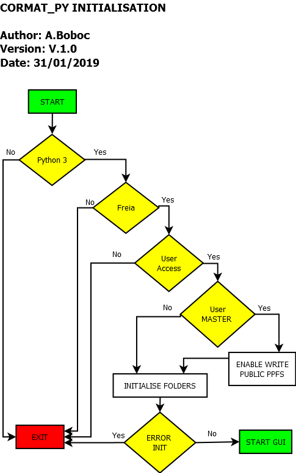

    Initialisation process

The code will check if is running in an 64bit enviroment with Python3. It will 
also check what user is running the code and if it has proper authorisation to 
write KG1 public ppfs.
If not, the user will be able to run the code but he/she will be limited in 
writing only private ppfs.

If the user has chosen so, during the initialisation process also the 
documentation can be produced (updated).

After the inialization process, if finished successfully, the user will be 
prompted with the GUI:

.. figure:: _figure/main_windows.png
    :align: center
    :alt: alternate text
    :figclass: align-center

    Main GUI

Window size will be scaled to dimension of screen resolution.
It is advisable to scale a bit the dimension of the window to read messages on 
terminal even though all messages will be displayed as well inside the GUI.

Principles of operation
------------------------------------

After chosing a pulse 

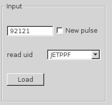

    Pulse selection

The user can use the drop down menu in Figure to choose the read_uid.

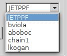

    list of authorised users (to write KG1 ppfs)

The list that is shown here contains all user that are authorised to write KG1 
public ppf.
After clicking the load button, the code  start running according to:

    
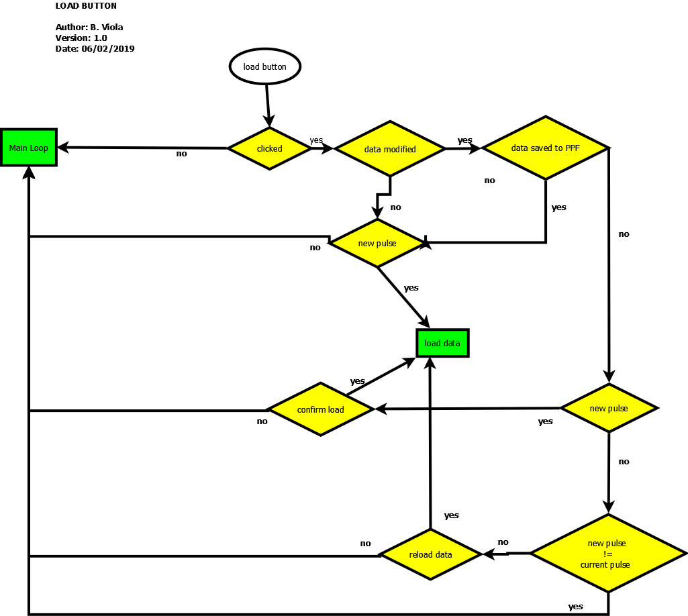

    Load button logic
    
After loading a pulse the user now will have to choose a pulse to validate.    
    

.. figure:: _figure/data_plotted.png
    :align: center
    :alt: alternate text
    :figclass: align-center

    Pulse selection

All figure windows come with a navigation toolbar, which can be used to navigate 
through the data set. Here is a description of each of the buttons at the bottom 
of the toolbar

    
    Navigation toolbar

The Home, Forward and Back buttons

	
	Home, Forward and Back buttons
	
These are akin to a web browser's home, forward and back controls. Forward and Back are used to navigate back and forth between previously defined views. They have no meaning unless you have already navigated somewhere else using the pan and zoom buttons. This is analogous to trying to click Back on your web browser before visiting a new page or Forward before you have gone back to a page -- nothing happens. Home always takes you to the first, default view of your data. Again, all of these buttons should feel very familiar to any user of a web browser.

The Pan/Zoom button

    
    Zoom button
    
This button has two modes: pan and zoom. Click the toolbar button to activate panning and zooming, then put your mouse somewhere over an axes. Press the left mouse button and hold it to pan the figure, dragging it to a new position. When you release it, the data under the point where you pressed will be moved to the point where you released. If you press 'x' or 'y' while panning the motion will be constrained to the x or y axis, respectively. Press the right mouse button to zoom, dragging it to a new position. The x axis will be zoomed in proportionately to the rightward movement and zoomed out proportionately to the leftward movement. The same is true for the y axis and up/down motions. The point under your mouse when you begin the zoom remains stationary, allowing you to zoom in or out around that point as much as you wish. You can use the modifier keys 'x', 'y' or 'CONTROL' to constrain the zoom to the x axis, the y axis, or aspect ratio preserve, respectively.

With polar plots, the pan and zoom functionality behaves differently. The radius axis labels can be dragged using the left mouse button. The radius scale can be zoomed in and out using the right mouse button.

The Zoom-to-rectangle button

    
    Zoom to rectangle
    
Click this toolbar button to activate this mode. Put your mouse somewhere over an axes and press a mouse button. Define a rectangular region by dragging the mouse while holding the button to a new location. When using the left mouse button, the axes view limits will be zoomed to the defined region. When using the right mouse button, the axes view limits will be zoomed out, placing the original axes in the defined region.

The Subplot-configuration button

    
    subplot preferences
    
Use this tool to configure the appearance of the subplot: you can stretch or compress the left, right, top, or bottom side of the subplot, or the space between the rows or space between the columns.

The Save button

    
    save button
    
Click this button to launch a file save dialog. You can save files with the following extensions: png, ps, eps, svg and pdf.

Action by user to make corrections are carried out by hitting a key and making mouse clicks.

The keyboard hits establish a "mode" with subsequent mouse click(s) expected. 
An overview of valid key strokes is given in the following table.

+------+-----------------------------+
| Key | Purpose                      |
+======+=============================+
| .    | single correction           |
+------+-----------------------------+
| M    | multiple correction         |
+------+-----------------------------+
| N    | neutralise corrections/s    |
+------+-----------------------------+
| T    | zero LID (tail) data        |
+------+-----------------------------+
| Z    | zero LID (interval) data    |
+------+-----------------------------+

For further details see relative paragraph on topic/s.

Note that any action, valid or not, triggers a clear response, i.e. either the final result expected (user performed action correctly) or an error message with be displayed.

There is NO option so far to excape from an unwanted mode, event has to finish.

How to define the Time value(s) of correction(s)
------------------------------------------------

Before the value of a fringe jump correction in unit of fringes can be entered at a dedicated prompt in a Widget, the associated time point(s) have to be defined and, thus, the right correction mode must be raised.

Single correction
##################

Hit the key **[.]** and then click between the two data points in question with the **right** mouse button. The vertical position of the pointer is unimportant.

A widget will be prompeted and the user will have to click the correction to be applied in fringe units

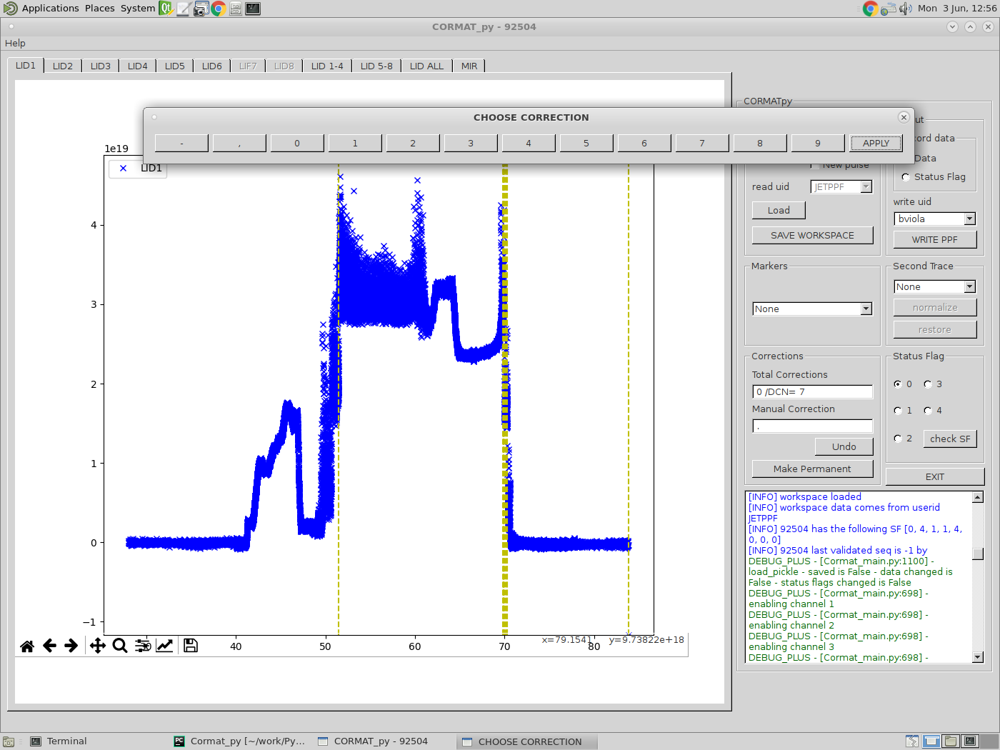
    
    select fringe correction to be applied
    

after selecting the correction to be applied, and pressing **apply** the canvas will be updated and a magenta line will appear on the selected data point.

the user will be promped with a widged asking if he/she wants to confirm that correction or, instead, apply the displayed suggested correction.

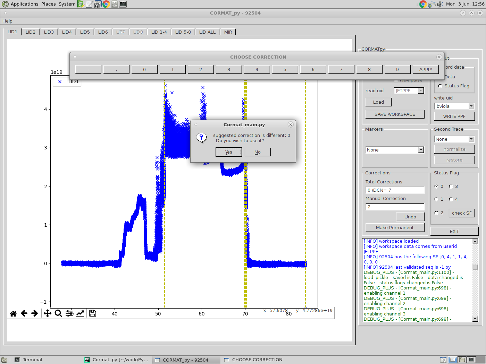
    
    select fringe correction to be applied
    
    
and then with another widget asking to confirm the correction and mark it as **permanent**, which means the correction will be stored.

Multiple correction
##################

Hit the key **[M]** and you will be in the multicorrection mode.

You will have to click as many time points as you like and you then select in the widget the chosen correction to apply and that will be applied to all selected data points.

**Note that the sign of a correction is given by the jump (+/-) to be removed.**

Neutralise correction(s)
##################

Hit the key **[N]** and you will be in the neutralisation mode.

All corrections manual and/or intershot (made by hardware) can be removed by generating the corresponding neutralising new correction, all at once.

In order to do so:
	1) make sure there are no pending corrections (press mark permanent button)
	2) Hit the key **[N]** to invoke this mode
	3) define time window by two mouse right clicks
	
	
First all manual corrections within the chose timw window will be neutralised and then intershot corrections.

Zeroing LID data
##################

Sometimes, expecially in the case of a disruption, it is desirable to bring everything down to zero for the uninteresting rest of the discharge (zeroing the tail) or just in a certain finite interval of very bad data.

To do so:
	1) make sure there are no pending corrections (press mark permanent button).
	2) Hit the key **[T]** to invoke zeroing mode of the tail.
	3) define time window by one mouse right click.
or
	2a) Hit the key **[Z]** to invoke zeroing mode of a selected interval.
	3a)define time window by two mouse right clicks.
	
Permanent corrections will be generated and take effect such that:
	i) all data points t>t1 or  in the interval t1 < t < t2 are put as close to zero as possible and
	ii) the sum of corrections is 0 if zeroing of the tail was invoked. Otherwise, the sum of corrections remains unchanged.
	
	
	
	
Undo correction(s)
##################

All corrections can be undo if they have not been made permanent by clicking the **undo** button. If user want to undo corrections already marked as permanet he/she shall use the neutralise mode by selecting the time interval where the correction(s) to be undo lay.

corrections_1z

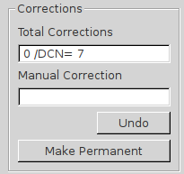
    
    Ttoal number of corrections, undo/mark permanent button

Plotting additional signals and plasma markers
------------------------------------------------
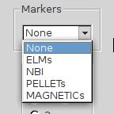
    
    Combo box selection for plasma marker

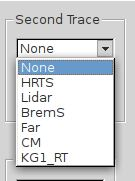
    
    Combo box selection for second trace

How to set the status flag of a channel
------------------------------------------------

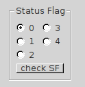
    
    change status flag to channel

Saving data and storing Status flags
------------------------------------------------

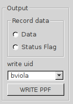
    
    
    
    select fringe correction to be applied

     
    

